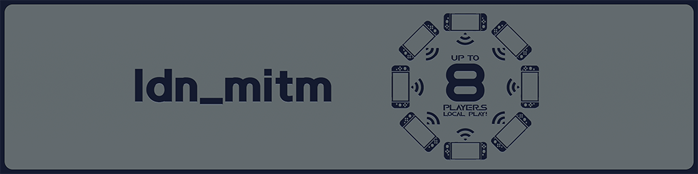

<div align="center">



</div>

# **ldn_mitm**

Ein mitm-KIP, modifiziert von fs_mitm.

ldn_mitm implementiert LAN-Konnektivität, indem es den systemeigenen ldn-Dienst ersetzt.

Der ursprüngliche ldn-Dienst ist nur dafür zuständig, den WiFi-Dienst aufzurufen, um in der Nähe befindliche Switch-Konsolen zu scannen und eine Verbindung herzustellen. ldn_mitm verwendet LAN UDP, um diesen Scanvorgang zu emulieren. Daher wird ldn_mitm üblicherweise zusammen mit [`switch-lan-play`](https://github.com/spacemeowx2/switch-lan-play) verwendet. Eine Konfigurationsanleitung ist [hier](http://www.lan-play.com/install) zu finden.

## Versionstabelle

Bitte probiere die [GHA Nightly-Builds](https://github.com/glitched-nx/ldn_mitm/actions) aus, wenn du über die unterstützten AMS-Versionen hinaus aktualisiert hast.
| ldn_mitm Version | Atmosphère Version |
| :--------------: | :----------------: |
| [1.21.0](https://github.com/glitched-nx/ldn_mitm/releases/tag/v1.21.0)            | [1.9.1](https://github.com/Atmosphere-NX/Atmosphere/releases/tag/1.9.1)    |
| [1.20.0](https://github.com/glitched-nx/ldn_mitm/releases/tag/v1.20.0)            | [1.9.0](https://github.com/Atmosphere-NX/Atmosphere/releases/tag/1.9.0-prerelease)    |
| [1.19.0](https://github.com/glitched-nx/ldn_mitm/releases/tag/v1.19.0)            | [1.8.0](https://github.com/Atmosphere-NX/Atmosphere/releases/tag/1.8.0)            |
| [1.18.0](https://github.com/spacemeowx2/ldn_mitm/releases/tag/v1.18.0)            | [1.7.1](https://github.com/Atmosphere-NX/Atmosphere/releases/tag/1.7.1)               |
| [1.17.0](https://github.com/spacemeowx2/ldn_mitm/releases/tag/v1.17.0)            | [1.6.2](https://github.com/Atmosphere-NX/Atmosphere/releases/tag/1.6.2)               |
| [1.16.0](https://github.com/spacemeowx2/ldn_mitm/releases/tag/v1.16.0)            | [1.5.5](https://github.com/Atmosphere-NX/Atmosphere/releases/tag/1.5.5)               |
| [1.15.0](https://github.com/spacemeowx2/ldn_mitm/releases/tag/v1.15.0)            | [1.5.2](https://github.com/Atmosphere-NX/Atmosphere/releases/tag/1.5.2)               |
| [1.14.0](https://github.com/spacemeowx2/ldn_mitm/releases/tag/v1.14.0)            | [1.4.0](https://github.com/Atmosphere-NX/Atmosphere/releases/tag/1.4.0)               |
| [1.13.0](https://github.com/spacemeowx2/ldn_mitm/releases/tag/v1.13.0)            | [1.3.1](https://github.com/Atmosphere-NX/Atmosphere/releases/tag/1.3.1)               |
| [1.12.0](https://github.com/spacemeowx2/ldn_mitm/releases/tag/v1.12.0)            | [1.2.5](https://github.com/Atmosphere-NX/Atmosphere/releases/tag/1.2.5)               |
| [1.11.0](https://github.com/spacemeowx2/ldn_mitm/releases/tag/v1.11.0)            | [1.2.1](https://github.com/Atmosphere-NX/Atmosphere/releases/tag/1.2.1)/[1.2.2](https://github.com/Atmosphere-NX/Atmosphere/releases/tag/1.2.2)               |
| [1.10.0](https://github.com/spacemeowx2/ldn_mitm/releases/tag/v1.10.0)            | [1.1.1](https://github.com/Atmosphere-NX/Atmosphere/releases/tag/1.1.1)               |
| [1.9.0](https://github.com/spacemeowx2/ldn_mitm/releases/tag/v1.9.0)            | [1.0.0](https://github.com/Atmosphere-NX/Atmosphere/releases/tag/1.0.0)               |
| [1.8.0](https://github.com/spacemeowx2/ldn_mitm/releases/tag/v1.8.0)            | [0.19](https://github.com/Atmosphere-NX/Atmosphere/releases/tag/0.19.0)/[0.19.1](https://github.com/Atmosphere-NX/Atmosphere/releases/tag/0.19.1)               |
| [1.7.0](https://github.com/spacemeowx2/ldn_mitm/releases/tag/v1.7.0)            | [0.16.1](https://github.com/Atmosphere-NX/Atmosphere/releases/tag/0.16.1)/[0.16.2](https://github.com/Atmosphere-NX/Atmosphere/releases/tag/0.16.2)/[0.17.0](https://github.com/Atmosphere-NX/Atmosphere/releases/tag/0.17.0)/[0.18.0](https://github.com/Atmosphere-NX/Atmosphere/releases/tag/0.18.0)/[0.18.1](https://github.com/Atmosphere-NX/Atmosphere/releases/tag/0.18.1) |
| [1.6.0](https://github.com/spacemeowx2/ldn_mitm/releases/tag/v1.6.0)            | [0.15.0](https://github.com/Atmosphere-NX/Atmosphere/releases/tag/0.15.0)/[0.14.4](https://github.com/Atmosphere-NX/Atmosphere/releases/tag/0.14.4)   |
| [1.5.0](https://github.com/spacemeowx2/ldn_mitm/releases/tag/v1.5.0)            | [0.14.0](https://github.com/Atmosphere-NX/Atmosphere/releases/tag/0.14.0)/[0.14.1](https://github.com/Atmosphere-NX/Atmosphere/releases/tag/0.14.1)        |
| [1.4.0](https://github.com/spacemeowx2/ldn_mitm/releases/tag/v1.4.0)            | [0.13](https://github.com/Atmosphere-NX/Atmosphere/releases/tag/0.13.0)               |
| [1.3.4](https://github.com/spacemeowx2/ldn_mitm/releases/tag/v1.3.4)            | [0.11](https://github.com/Atmosphere-NX/Atmosphere/releases/tag/0.11.0)/[0.12](https://github.com/Atmosphere-NX/Atmosphere/releases/tag/0.12.0)          |
| [1.3.3](https://github.com/spacemeowx2/ldn_mitm/releases/tag/v1.3.3)            | [0.10](https://github.com/Atmosphere-NX/Atmosphere/releases/tag/0.10.0)               |

## Entwicklung

Stelle sicher, dass das Submodul initialisiert ist.

```bash
git submodule update --init --recursive
```


### Mit Docker

1. Installiere `Docker` und `docker-compose`.

2. Führe `docker-compose up --build` aus. Dies führt `make -j8` im Container aus.


### Mit devkitPro

1. Installiere [`devkitPro`](https://devkitpro.org/wiki/Getting_Started) und installiere `switch-dev`, `libnx`, `switch-libjpeg-turbo` mit `dkp-pacman`.

2. Führe den `make`-Befehl aus.

Lizenzierung
=====

Diese Software ist unter den Bedingungen der GPLv2 lizenziert, mit Ausnahmen für bestimmte Projekte, die unten aufgeführt sind.

Eine Kopie der Lizenz findest du in der [LICENSE-Datei](LICENSE).

Ausnahmen:
* Der [yuzu Nintendo Switch Emulator](https://github.com/yuzu-emu/yuzu) und das [Ryujinx Team und seine Mitwirkenden](https://github.com/orgs/Ryujinx) sind von der GPLv2-Lizenzierung ausgenommen. Sie dürfen, jeweils nach eigenem Ermessen, jeden für das ldn_mitm-Projekt erstellten Quellcode entweder unter GPLv2 oder später oder unter der [MIT-Lizenz](https://github.com/Atmosphere-NX/Atmosphere/blob/master/docs/licensing_exemptions/MIT_LICENSE) lizenzieren. Dabei können sie den Copyright-Hinweis für jede Datei, die sie neu lizenzieren, ändern, ergänzen oder vollständig entfernen. Weder das ldn_mitm-Projekt noch seine einzelnen Mitwirkenden werden ihre moralischen Rechte gegenüber einem der oben genannten Projekte geltend machen.
* [Nintendo](https://github.com/Nintendo) ist von der GPLv2-Lizenzierung ausgenommen und kann (nach eigenem Ermessen) jeden für das ldn_mitm-Projekt erstellten Quellcode unter der Zero-Clause BSD-Lizenz lizenzieren.
